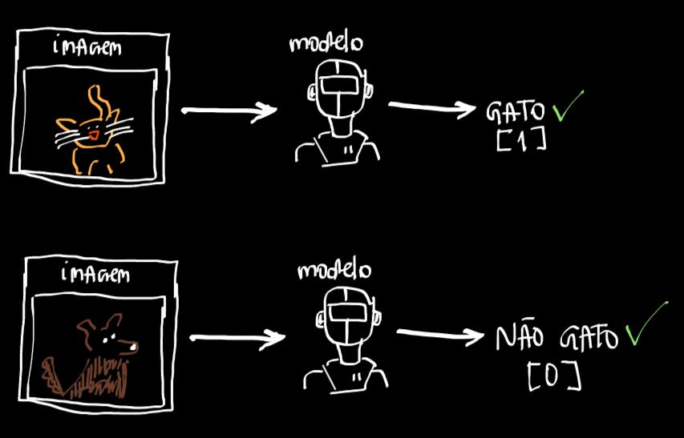
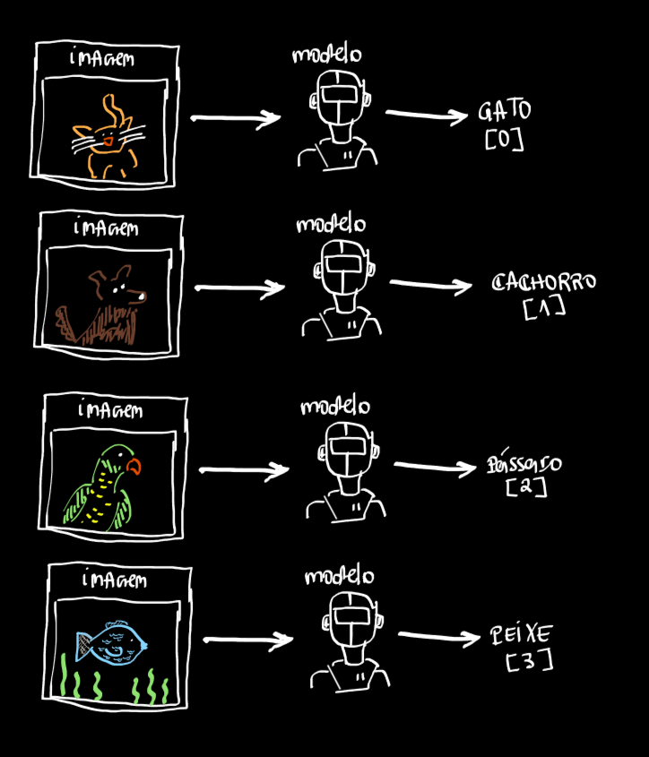
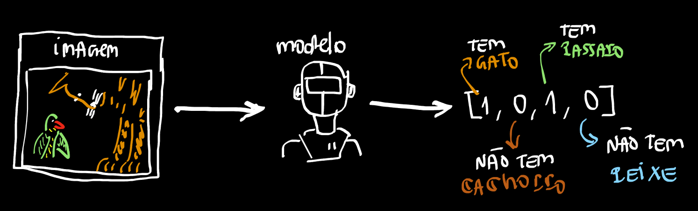

# O que é uma Classificação
Problemas de `classificação` são problemas onde estamos interessados em indentificar uma ou mais classes. E uma classe é uma **CATEGORIA** que o modelo aprende a prever.

## Classificação Binaria
Por exemplo queremos saber se temos ou não um gato na imagem:

- Não Gato = 0
- Gato = 1
O modelo aprende a prever **0** se não tem gato na imagem e **1** se vtem gato na imagem. Esse é um problema `BINARIO` pois temos **APENAS** 2 opções.


## Classificação Multiclasse
Um problema `MULTICLASS` é quando o modelo precisa identificar mais do que duas **CATEGORIA**. Por exemplo:

Qual animal está na imagem
- Gato: 0
- Cachorro: 1
- Pássaro: 2
- Peixe: 3

Perceba que, em uma imagem podemos podemos ter qualquer um dos 4 animais listados acima, logo o modelo aprenderá a prever 0 se tiver um gato na imagem, 1 se tiver um cachorro, 2 se tiver um pássaro e 3 se tiver um peixe na imagem. Isso é um problema `MULTICLASS` pois não temos apenas 0 ou 1 (problema `BINARIO`) temos 4 classes.



## Classificação MultiLabel (MultiOutput)
Um problema `MULTILABEL` é quando o modelo além de encontrar a **CATEGORIA** correta ele pode encontrar mais do que uma **CATEGORIA** simultaneamente. Por exemplo:

Quais animais aparecem em uma imagem:
- Gato
- Cachorro
- Pássaro
- Peixe

Agora não estamos interessados em **UM** animal estamos interessados em mais do que um ou até em nenhum, dessa forma o retorno do modelo é um vetor com a seguinte forma:
```python
# 1: possui a CATEGORIA
# 0: não possui a CATEGORIA
# Dessa forma nosso modelo preditou que na imagem nos temos um gato e um peixe
[1, 0, 0, 1]
# Somente um gato
[1, 0, 0, 0]
# Somente um cachorro
[0, 1, 0, 0]
# Somente um pássaro
[0, 0, 1, 0]
# Somente um peixe
[0, 0, 0, 1]
```
Ele pode dizer que na imagem temos os 4 animais:
```python
[1, 1, 1, 1]
```
